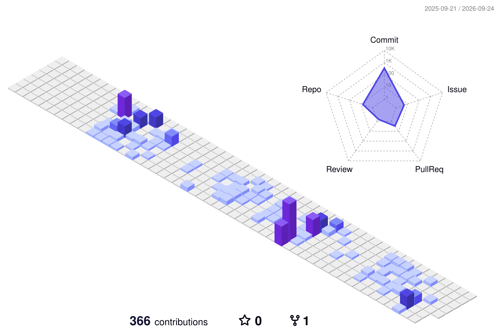

  

 

<table width="100%">
  <tr>
    <!-- 1층 좌측: 전체 사용 언어 donut 위젯 -->
    <td width="42%" align="center" valign="middle">
      
    </td>
    <!-- 1층 우측: 전체 깃허브 기여 stats 위젯 -->
    <td width="58%" align="center" valign="middle">
      
    </td>
  </tr>
  <tr>
    <!-- 2층 좌측: 준영님의 'algorithm' 레포 전용 Python 100% donut 위젯 -->
    <td width="42%" align="center" valign="middle">
      
    </td>
    <!-- 2층 우측: 준영님의 성실한 잔디 기록을 증명해 주는 연속 커밋 스트릭(Streak) 카드! -->
    <td width="58%" align="center" valign="middle">
      
    </td>
  </tr>
</table>

 

  

 

---

## Tech Stack

### Game Client Development

### Web Full-Stack Development

### AI & Deep Learning

### Collaboration & Support

---

## Projects

|  |  |
| :---: | :---: |
| **[자본주 E.T. (zabonzooET)](https://github.com/kkaemong/zabonzooET)** | **[개소릴레이 (gaesorelay)](https://github.com/gaesorelay/frontend)** |
|   |   |
| | |
|  |  |
| **[SSAIET](https://github.com/kkaemong/Final-PJT)** | **[SSAFY AI Challenge](https://github.com/kkaemong/SSAFY-AI-Challenge)** |
|   |   |
| | |
|  | |
| **[Web Hacking Project (K-Shield Jr)](https://github.com/kkaemong/Web-Hacking-Pjt)** | |
|   | |

---

## Education & Credentials
- **SSAFY AI 아카데미 14기** | Python 트랙 과정을 통한 CS 기본기 학습 및 웹/게임 클라이언트 부문 프로젝트 수행 (2025.07 ~ 현재)
- **협성대학교 경영학 전공** | 경영 데이터 분석 및 비즈니스 통계 이론 이수 (2018.03 ~ 2024.08)
- **과학기술정보통신부 제 11기 K-Shield Jr** | 실무 중심의 정보보안 및 웹 취약점 진단 과정 200시간 수료 (2023.09 ~ 2023.10)
- **Philippines Residency** | 7년 해외 거주를 통한 자연스러운 영어 회화 및 글로벌 커뮤니케이션 역량 확보 (2002 ~ 2009)

---

## Contact
* Email: **junemay31@naver.com**
* Blog: **[Velog](https://velog.io/@junemay31/posts)**
* GitHub: **[github.com/kkaemong](https://github.com/kkaemong)**
* Portfolio: **https://portpolio-ruddy-beta.vercel.app/**
